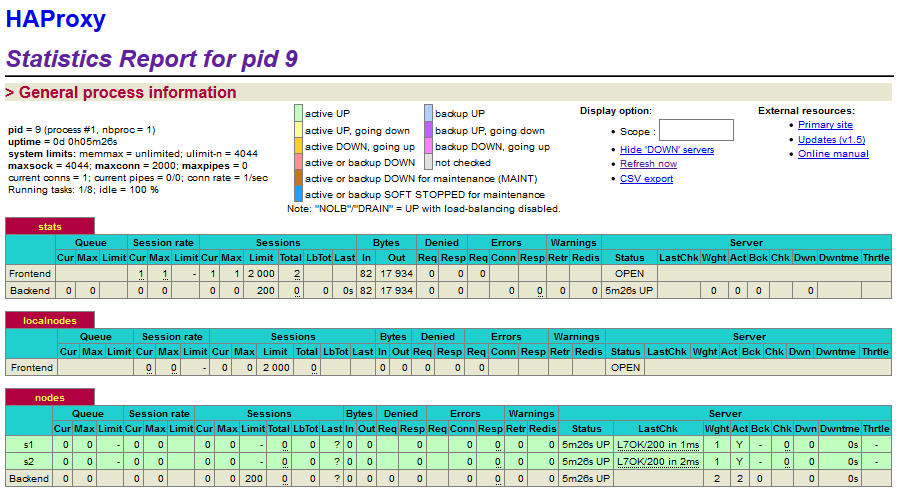
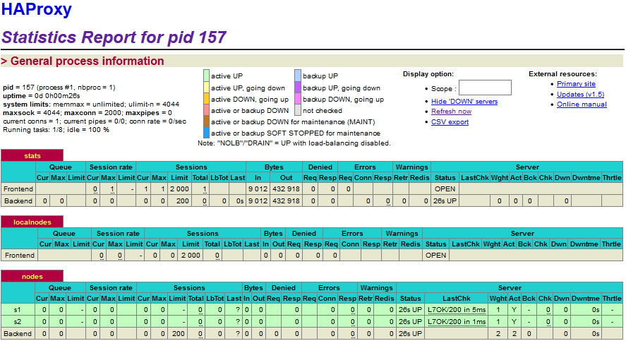

# Laboratoire 04 - Docker

## Table of contents 

0. [Introduction](#introduction)
1. [Identify issues and install the tools](#task-0)
2. [Add a process supervisor to run several processes](#task-1)
3. [Add a tool to manage membership in the web server cluster](#task-2)
4. [React to membership changes](#task-3)
5. [Use a template engine to easily generate configuration files](#task-4)
6. [Generate a new load balancer configuration when membership changes](#task-5)
7. [Make the load balancer automatically reload the new configuration](#task-6)
8. [Difficulties](#difficulties)
9. [Conlusion](#conclusion)


## <a name="introduction">Introduction</a>


## <a name="task-0">Task 0: Identify issues and install the tools</a>

1. <a name="M1"></a>**[M1]** Do you think we can use the current solution for a production environment? What are the main problems when deploying it in a production environment?
   
    L'infrastructure proposée dans le labo 3 ne peut pas convenir en production. Cette dernière est beaucoup trop statique et implique trop de downtime en cas d'arrêt d'un serveur pour être utilisé en utilisation réelle.

2. <a name="M2"></a>**[M2]** Describe what you need to do to add new `webapp` container to the infrastructure. Give the exact steps of what you have to do without modifiying the way the things are done. Hint: You probably have to modify some configuration and script files in a Docker image.
   
    Pour ajouter des webapps, nous devons modifier le script de provisioning ([re]provision.sh) pour y ajouter des containers webapps supplémentaires et les démarrer dans les bons serveurs. Ex: ajouter un dockerfile pour une autre webapp1:
      ```bash
      echo "************************  build webapp image  ************************"
      cd /vagrant/webapp
      docker build -t softengheigvd/webapp .
      docker build -t softengheigvd/webapp1 .
      # Run three webapps
      echo "************************  run webapps  ************************"
      docker rm -f s1 2>/dev/null || true
      docker rm -f s2 2>/dev/null || true
      docker run -d --name s1 softengheigvd/webapp
      docker run -d --name s2 softengheigvd/webapp
      docker run -d --name s3 softengheigvd/webapp1
      # Run load balancer
      echo "************************  run HAProxy  ************************"
      docker rm -f ha 2>/dev/null || true
      docker run -d -p 80:80 -p 1936:1936 -p 9999:9999 --link s1 --link s2 --link s3 --name ha softengheigvd/ha
      ```
   De plus, il faut ajouter à la configuration d'HAProxy, le ou les noeuds supplémentaires correspondants.
   ```    
    # Define the list of nodes to be in the balancing mechanism
    # http://cbonte.github.io/HAProxy-dconv/configuration-1.5.html#4-server
    # HANDLEBARS START
    server s1 <s1>:3000 check
    server s2 <s2>:3000 check
    server s3 <s3>:3000 check
    # HANDLEBARS END
    ```


3. <a name="M3"></a>**[M3]** Based on your previous answers, you have detected some issues in the current solution. Now propose a better approach at a high level.
  
    On pourrait utiliser docker swarm qui permet une meilleure gestion des containers ainsi qu'un meilleur échelonnage en cas d'un nombre de visite plus grand apporte l'avantage de ne plus être obliger de gérer un load balancer puisque l'on peut utiliser celui fournit par docker swarm. Ainsi que d'autres avantages : 
    <a href=https://docs.docker.com/engine/swarm/>Aperçu de docker swarm</a> 
    <a href=https://docs.docker.com/engine/swarm/key-concepts/>Concept clé de docker swarm</a>

4. <a name="M4"></a>**[M4]** You probably noticed that the list of web application nodes is hardcoded in the load balancer configuration. How can we manage the web app nodes in a more dynamic fashion?

   Via l'utilisation de la HAProxy Runtime API et de template, la configuration de HAProxy serait dès lors gérée dynamiquement et il serait plus facile de remettre en service des serveurs. Pour plus d'information voir : <a href=https://www.haproxy.com/blog/dynamic-configuration-haproxy-runtime-api/>HAProxy Runtime API</a>

5. <a name="M5"></a>**[M5]** In the physical or virtual machines of a typical infrastructure we tend to have not only one main process (like the web server or the load balancer) running, but a few additional processes on the side to perform management tasks.

   For example to monitor the distributed system as a whole it is common to collect in one centralized place all the logs produced by the different machines. Therefore we need a process running on each machine that will forward the logs to the central place. (We could also imagine a central tool that reaches out to each machine to gather the logs. That's a push vs. pull problem.) It is quite common to see a push mechanism used for this kind of task.

   Do you think our current solution is able to run additional management processes beside the main web server / load balancer process in a container? If no, what is missing / required to reach the goal? If yes, how to proceed to run for example a log forwarding process?
   
    Actuellement, chaque Dockerfile et script `run.sh` n'installent et ne démarrent qu'un seul service, à l'exception de HAProxy qui run `rsyslog` pour garder les logs en local seulement. Cependant on pourrait installer et lancer `rsyslog` sur les deux serveurs ou d'autres daemon de management et permettre ainsi d'envoyer des traps smnp par exemple sur un server central. Une autre solution serait de mettre en place des volumes partagés entre les containers et la machine hôte mais bien que cela peut centraliser les logs, ce n'est pas viable si l'on travaille avec plusieurs machines physiques. La dernières solution serait d'utiliser des logiciels tel que Nagios ou TrueSight qui est spécialisé dans le monitoring cloud.
    
    
6. <a name="M6"></a>**[M6]** In our current solution, although the load balancer configuration is changing dynamically, it doesn't follow dynamically the configuration of our distributed system when web servers are added or removed. If we take a closer look at the `run.sh` script, we see two calls to `sed` which will replace two lines in the `HAProxy.cfg` configuration file just before we start `HAProxy`. You clearly see that the configuration file has two lines and the script will replace these two lines.

   What happens if we add more web server nodes? Do you think it is really dynamic? It's far away from being a dynamic configuration. Can you propose a solution to solve this?
   
   Ce n'est pas vraiment dynamique, il faudrait à chaque ajout de serveur ajouter une ligne dans ce fichier, ce qui n'est pas vraiment embêtant dans une petit infrastructure mais le deviendrait plus elle grandira. La solution la plus envisageable serait celle fournit par l'utilisation de le HAProxy Runtime API et de template. 
   

**Deliverables**:

1. Take a screenshot of the stats page of HAProxy at <http://192.168.42.42:1936>. You should see your backend nodes.



2. Give the URL of your repository URL in the lab report.
   <https://github.com/mitraillet/Teaching-HEIGVD-AIT-2016-Labo-Docker>


## <a name="task-1">Task 1: Add a process supervisor to run several processes</a>

**Deliverables**:

1. Take a screenshot of the stats page of HAProxy at <http://192.168.42.42:1936>. You should see your backend nodes. It should be really similar to the screenshot of the previous task.



2. Describe your difficulties for this task and your understanding of what is happening during this task. Explain in your own words why are we installing a process supervisor. Do not hesitate to do more research and to find more articles on that topic to illustrate the problem.

    Nous téléchargeons et installons S6 dans les différents containers, nous changeons le ENTRYPOINT avec /init pour que les exécutions de commande se produisent via S6 et ensuite, nous copions les scripts run de la machine hôte vers les containers pour enfin les exécuter après le démarrage de S6 qui est le premier processus à se mettre en marche.
    Nous installons un superviseur pour surveiller les serveurs et permettre ainsi de gérer les logs plus facilement.

## <a name="task-2">Task 2: Add a tool to manage membership in the web server cluster</a>

**Deliverables**:

1. Provide the docker log output for each of the containers: `ha`, `s1` and `s2`. You need to create a folder `logs` in your repository to store the files separately from the lab report. For each lab task create a folder and name it using the task number. No need to create a folder when there are no logs.

   Example:

   ```
   |-- root folder
     |-- logs
       |-- task 1
       |-- task 3
       |-- ...
   ```

2. Give the answer to the question about the existing problem with the current solution.

    La solution actuelle présente comme problème que l'on travaille en centraliser avec tous les serveurs se joignant au cluster via ha alors que le but de serf est de travailler en décentraliser. L'autre inconvénient majeur est que la configuration n'est pas dynamique donc si ha ne démarre pas en premier ou alors quitte le cluster, aucun cluster ne sera crée ou aucun périphérique ne rejoindra le cluster existant et donc pas de log même si l'on démarre ha après s1 et s2. D'où l'importance de travailler en décentralisant et en se connectant au précédent serveur mise en service ce qui par cascade permet d'avoir un cluster et que ha pourrait rejoindre en prenant l'exemple précédemment cité.

3. Give an explanation on how `Serf` is working. Read the official website to get more details about the `GOSSIP` protocol used in `Serf`. Try to find other solutions that can be used to solve similar situations where we need some auto-discovery mechanism.

    Serf fonctionne sur un principe de groupe/cluster et de diffusion d'information au sein d'un groupe. Lorsqu'un serveur active serf soit il peut rejoindre un groupe, soit il en crée un. S'il en crée un alors, il s'attend à être rejoint par d'autres périphériques. Pour rejoindre un cluster, il suffit de donner l'adresse d'au moins un membre du groupe, un serveur rejoignant un cluster va d'abord faire une synchronisation d'état complète avec le serveur existant sur TCP et ensuite, envoie ses informations au groupe. Dans ce protocole, une mise à jour est faite régulièrement entre tous les membres d'un cluster.
    
    Sur ce site <a href=https://www.ctl.io/developers/blog/post/decentralizing-docker-how-to-use-serf-with-docker/>Decentralizing Docker: How to Use Serf with Docker</a>, on nous donne des informations pour ajouter de manière manuelle des containers à un cluster Serf mais on pourrait très bien transformer cela en script pour créer automatiquement un cluster à l'initialisation des containers.
    Il existe d'autres solutions comme <a href=https://www.consul.io/>Consul</a>, <a href=http://zookeeper.apache.org/>ZooKeeper</a> <a href=https://github.com/ha/doozerd>doozerd</a>, <a href=https://coreos.com/etcd/>etcd</a>. Consul est l'équivalent de Serf mais en centraliser ce qui lui permet de posséder des fonctionnalités plus poussées. ZooKeeper, doozerd et etcd sont des solutions centraliser mais qui demande une configuration de base beaucoup plus poussées que Serf mais par la suite permettent plus de fonctionnalité.
    
## <a name="task-3">Task 3: React to membership changes</a>

**Deliverables**:

1. Provide the docker log output for each of the containers:  `ha`, `s1` and `s2`.
   Put your logs in the `logs` directory you created in the previous task.


3. Provide the logs from the `ha` container gathered directly from the `/var/log/serf.log`
   file present in the container. Put the logs in the `logs` directory in your repo.


## <a name="task-4">Task 4: Use a template engine to easily generate configuration files</a>

**Deliverables**:

1. You probably noticed when we added `xz-utils`, we have to rebuild
   the whole image which took some time. What can we do to mitigate
   that? Take a look at the Docker documentation on
   [image layers](https://docs.docker.com/engine/userguide/storagedriver/imagesandcontainers/#images-and-layers).
   Tell us about the pros and cons to merge as much as possible of the
   command. In other words, compare:

  ```
  RUN command 1
  RUN command 2
  RUN command 3
  ```

  vs.

  ```
  RUN command 1 && command 2 && command 3
  ```

  There are also some articles about techniques to reduce the image
  size. Try to find them. They are talking about `squashing` or
  `flattening` images.

2. Propose a different approach to architecture our images to be able
   to reuse as much as possible what we have done. Your proposition
   should also try to avoid as much as possible repetitions between
   your images.

3. Provide the `/tmp/HAProxy.cfg` file generated in the `ha` container
   after each step.  Place the output into the `logs` folder like you
   already did for the Docker logs in the previous tasks. Three files
   are expected.
   
   In addition, provide a log file containing the output of the 
   `docker ps` console and another file (per container) with
   `docker inspect <container>`. Four files are expected.
   
4. Based on the three output files you have collected, what can you
   say about the way we generate it? What is the problem if any?


## <a name="task-5">Task 5: Generate a new load balancer configuration when membership changes</a>

**Deliverables**:

1. Provide the file `/usr/local/etc/HAProxy/HAProxy.cfg` generated in
   the `ha` container after each step. Three files are expected.
   
   In addition, provide a log file containing the output of the 
   `docker ps` console and another file (per container) with
   `docker inspect <container>`. Four files are expected.

2. Provide the list of files from the `/nodes` folder inside the `ha` container.
   One file expected with the command output.

3. Provide the configuration file after you stopped one container and
   the list of nodes present in the `/nodes` folder. One file expected
   with the command output. Two files are expected.
   
    In addition, provide a log file containing the output of the 
   `docker ps` console. One file expected.

4. (Optional:) Propose a different approach to manage the list of backend
   nodes. You do not need to implement it. You can also propose your
   own tools or the ones you discovered online. In that case, do not
   forget to cite your references.
   
   
## <a name="task-6">Task 6: Make the load balancer automatically reload the new configuration</a>

**Deliverables**:

1. Take a screenshots of the HAProxy stat page showing more than 2 web
   applications running. Additional screenshots are welcome to see a
   sequence of experimentations like shutting down a node and starting
   more nodes.
   
   Also provide the output of `docker ps` in a log file. At least 
   one file is expected. You can provide one output per step of your
   experimentation according to your screenshots.
   
2. Give your own feelings about the final solution. Propose
   improvements or ways to do the things differently. If any, provide
   references to your readings for the improvements.

3. (Optional:) Present a live demo where you add and remove a backend container.


## <a name="difficulties">Difficulties</a>


## <a name="conclusion">Conlusion</a>